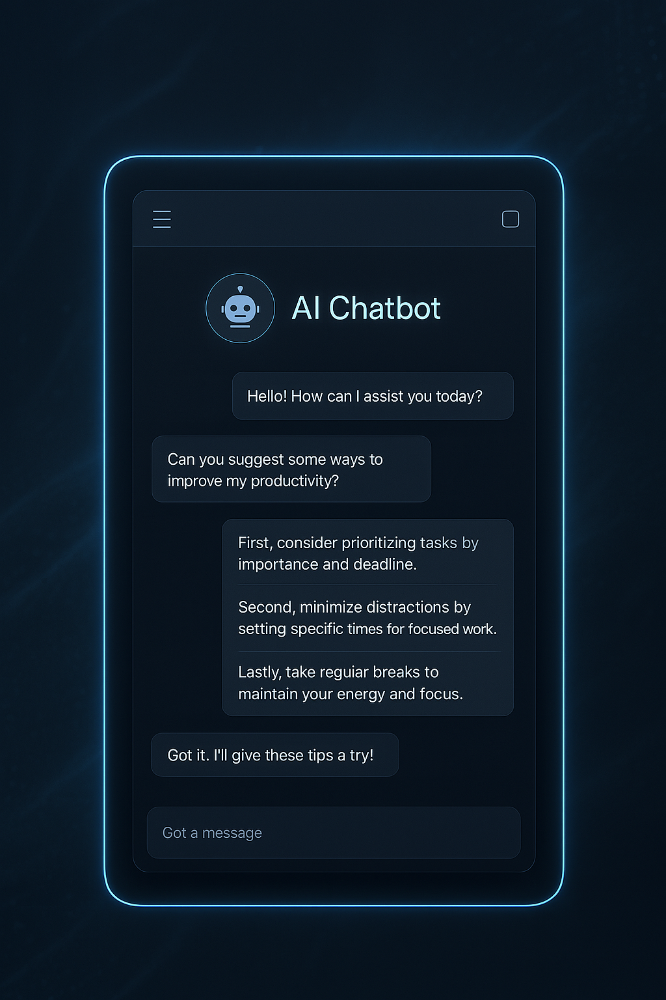

# Chatbot Quality Guide

## Table of Contents
- [Characteristics of Good Chatbots](#characteristics-of-good-chatbots)
- [Characteristics of Bad Chatbots](#characteristics-of-bad-chatbots)
- [Good Chatbot Example](#good-chatbot-example)
- [Bad Chatbot Example](#bad-chatbot-example)
- [Resources](#resources)


## Characteristics of Good Chatbots


### 1. Effective Problem Resolution
- Provides *accurate* and relevant information without hallucination
- Offers actionable solutions, not just acknowledgments
- Knows when to escalate to human support

### 2. Contextual Awareness
- Remembers previous parts of the conversation
- References earlier statements when appropriate
- Avoids asking for information the user has already provided

### 3. Natural Language Understanding
- *Accurately* interprets user queries even when phrased conversationally
- Handles **variations in language** and colloquialisms

### 4. Personality & Tone
- Maintains a **consistent voice** that aligns with brand values
- Adapts tone based on user emotion and conversation subject
- Feels human-like without pretending to be human

### 5. Continuous Improvement
- Learns from interactions to improve responses
- Regularly updates knowledge base
- Adapts to new user needs and expectations

## Characteristics of Bad Chatbots


### 1. Misleading Capabilities
- Suggests it can handle tasks beyond its actual abilities
- Creates **false expectations** about resolution timelines
- Doesn't clearly communicate limitations

### 2. Repetitive Responses
- Uses the same templated answers regardless of context
- Falls back to generic responses too frequently
- Cannot adapt language to different situations

### 3. Poor Error Handling
- Responds with "I don't understand" without suggesting alternatives
- **Loops endlessly** in error states
- Provides no clear path to resolution when confused

### 4. Rigid Understanding
- Only responds to *exact keyword matches*
- **Fails to interpret** natural language variations
- Loses context between messages

### 5. Inappropriate Escalation
- Fails to recognize when human intervention is needed
- Makes escalation process *unnecessarily complicated*
- Doesn't preserve conversation history when transferring to humans


## Good Chatbot Example

### Banking Assistant - Account Management

```
Customer: Hi, I need to check my account balance and also report my card as lost.

Chatbot: I can help with both of those requests. First, let's check your balance. 
Would you like to see your checking or savings account balance?

Customer: Checking account, please.

Chatbot: Your checking account balance is $1,243.65 as of today. 

Now about your lost card - I'll need to verify your identity before proceeding. 
Can you confirm the last four digits of your Social Security Number?

Customer: 5678

Chatbot: Thank you for verifying. I've placed a hold on your card ending in 9012. 
A replacement will be mailed to your address on file (123 Main St) within 3-5 business days.

Is there anything else you need help with today?

Customer: When exactly will it arrive?

Chatbot: Based on current processing times, you should receive your new card by 
Tuesday, April 1st. Would you like me to send you a tracking number when it ships?

Customer: Yes please.

Chatbot: Perfect! I've set up a notification to send you the tracking information
via email. Is there anything else I can assist with today?
```

## Bad Chatbot Example

### Internet Service Provider Support

```
Customer: My internet keeps dropping every 30 minutes or so.

Chatbot: I'm sorry to hear you're experiencing issues with your internet service.
Have you tried restarting your router?

Customer: Yes, I've already restarted it three times today.

Chatbot: Great! Restarting your router often resolves connectivity issues.
Is there anything else I can help you with?

Customer: No, restarting didn't help. I need a different solution.

Chatbot: I understand. Please try unplugging your router for 30 seconds, 
then plugging it back in.

Customer: That's the same as restarting, which I said didn't work.

Chatbot: I'm sorry for the confusion. Would you like me to connect you
with a technical support representative?

Customer: Yes, please.

Chatbot: Please visit our website at support.example.com to schedule a
callback from our technical team. Thank you for contacting us!
```

## Resources

### Design Guidelines
- [Google Conversational Design Guidelines](https://developers.google.com/assistant/conversation-design/learn-about-conversation)
- [Microsoft Bot Framework Documentation](https://docs.microsoft.com/en-us/azure/bot-service/?view=azure-bot-service-4.0)

### Video Resources
- [Build a Large Language Model AI Chatbot using Retrieval Augmented Generation](https://youtu.be/XctooiH0moI?si=Wb_rObnSxi_C7RhF)
- [Build and Deploy a RAG Chatbot with JavaScript, LangChain.js, Next.js, Vercel, OpenAI](https://www.youtube.com/watch?v=d-VKYF4Zow0)
