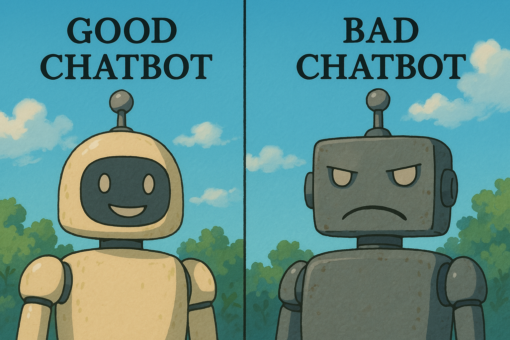

<br><br>

# Chatbot Quality Guide

## Table of Contents

- [Introduction](#introduction)
  - [What is a Chatbot?](#what-is-a-chatbot)
  - [Evolution of Chatbots](#evolution-of-chatbots)
- [Characteristics of Good Chatbots](#characteristics-of-good-chatbots)
- [Characteristics of Bad Chatbots](#characteristics-of-bad-chatbots)
- [Chatbot Excellence Framework](#chatbot-excellence-framework-a-comparative-summary)
  - [The Three Pillars of Chatbot Excellence](#the-three-pillars-of-chatbot-excellence)
  - [The Balanced Chatbot](#core-insight-the-balanced-chatbot)
- [Good Chatbot Example](#good-chatbot-example)
- [Bad Chatbot Example](#bad-chatbot-example)
- [Resources](#resources)

## Introduction

### What is a Chatbot?

A chatbot is a software application designed to conduct conversations with human users through text or voice interactions. These digital assistants simulate human-like conversations using various technologies ranging from simple rule-based systems to sophisticated artificial intelligence.

### Evolution of Chatbots


| Era | Year Range | Description | Notable Example |
|-----|------------|-------------|----------------|
| **Rule-Based Chatbots** | 1966-2000 | Relied on predefined rules and pattern matching to respond to specific keywords or phrases. | **ELIZA (1966)**: MIT's pioneering chatbot that simulated a psychotherapist using pattern matching. |
| **ML/DL Chatbots** | 2000-2018 | Utilized machine learning algorithms to understand context and improve responses over time. | **Watson Assistant (2016)**: IBM's platform using machine learning to understand natural language. |
| **AI Chatbots** | 2018-2022 | Incorporated large language models (LLMs) with generative capabilities for more nuanced understanding. | **ChatGPT (2022)**: OpenAI's conversational model based on GPT architecture for detailed conversations. |
| **AI Chatbots with Tools** | 2022-2024 | Access external tools and information sources, expanding capabilities beyond training data. | **GPT-4o (2024)**: Capability to browse the web, analyze images, create visual content, and integrate with third-party services. |
| **AI Agents** | 2023-Present | Take autonomous actions to complete complex tasks by chaining multiple steps and tools. | **Devin (2024)**: Cognition's AI software engineer that plans and executes complex coding projects with minimal oversight. |
| **Physical AI (Future)** | 2025+ | AI chatbots embodied in physical systems that interact with the real world. | **Tesla Optimus**: Humanoid robot in development designed to perform physical tasks while maintaining conversational capabilities. |

## Characteristics of Good Chatbots
<br>
<div style="display: flex; align-items: flex-start; gap: 40px;">


<div>

### 1. Effective Problem Resolution

- Provides *accurate* and relevant information without hallucination  
- Offers actionable solutions, not just acknowledgments  
- Knows when to escalate to human support  

### 2. Contextual Awareness

- Remembers previous parts of the conversation  
- References earlier statements when appropriate  
- Avoids asking for information the user has already provided  

### 3. Natural Language Understanding

- *Accurately* interprets user queries even when phrased conversationally  
- Handles **variations in language** and colloquialisms  

### 4. Personality & Tone

- Maintains a **consistent voice** that aligns with brand values  
- Adapts tone based on user emotion and conversation subject  
- Feels human-like without pretending to be human  

### 5. Continuous Improvement

- Learns from interactions to improve responses  
- Regularly updates knowledge base  
- Adapts to new user needs and expectations  

</div>
</div>

## Characteristics of Bad Chatbots
<br>
<div style="display: flex; align-items: flex-start; gap: 40px;">


<div>

### 1. Misleading Capabilities
- Suggests it can handle tasks beyond its actual abilities  
- Creates **false expectations** about resolution timelines  
- Doesn't clearly communicate limitations  

### 2. Repetitive Responses
- Uses the same templated answers regardless of context  
- Falls back to generic responses too frequently  
- Cannot adapt language to different situations  

### 3. Poor Error Handling
- Responds with "I don't understand" without suggesting alternatives  
- **Loops endlessly** in error states  
- Provides no clear path to resolution when confused  

### 4. Rigid Understanding
- Only responds to *exact keyword matches*  
- **Fails to interpret** natural language variations  
- Loses context between messages  

### 5. Inappropriate Escalation
- Fails to recognize when human intervention is needed  
- Makes escalation process *unnecessarily complicated*  
- Doesn't preserve conversation history when transferring to humans  

</div>
</div>

<br><br>

## Chatbot Excellence Framework: A Comparative Summary

The difference between good and bad chatbots can be distilled into three fundamental dimensions that mirror human excellence: intellectual capability (IQ), emotional intelligence (EQ), and capacity for growth. Each dimension is enhanced by specific technologies and design principles.

### The Three Pillars of Chatbot Excellence

| Dimension | Good Chatbots | Bad Chatbots | Enabling Technologies |
|-----------|---------------|--------------|----------------------|
| 🧑🏽‍🔧 **Problem-Solving Skills (IQ)** | Provide accurate solutions, recognize their limitations, take effective actions, and know when to escalate | Hallucinate information, overpromise capabilities, get stuck in error loops, and fail to resolve issues | • Large Language Models (LLMs)<br>• Retrieval Augmented Generation (RAG)<br>• Tool integration frameworks<br>• Human-in-the-loop systems |
| 👫🏽 **Social Intelligence (EQ)** | Maintain conversational context, adapt tone appropriately, respond to emotional cues, and build rapport without manipulation | Use rigid templates, ignore context, miss emotional signals, and create frustrating interactions | • Contextual memory systems<br>• Personality design frameworks<br>• Sentiment analysis<br>• Ethical guardrails |
| 🦾 **Improvement Capacity** | Continuously learn from interactions, update knowledge, and adapt to changing user needs | Remain static, repeat the same errors, and fail to incorporate feedback | • Reinforcement Learning from Human Feedback (RLHF)<br>• Continuous model updating<br>• Usage analytics systems |


### Core Insight: The Balanced Chatbot

The most effective chatbots maintain balance across all three dimensions. Just as with human excellence, overemphasis on any single aspect creates limitations. Technical sophistication without emotional intelligence creates sterile interactions; personability without problem-solving creates friendly but ineffective experiences; and either without the capacity to grow leads to obsolescence.

| Balanced Approach | Imbalanced Approach |
|-------------------|---------------------|
| Solves problems effectively while maintaining natural conversation | Over-optimizes for technical capability at the expense of user experience |
| Adapts tone while staying focused on resolution | Prioritizes friendliness over actual problem-solving |
| Grows incrementally based on meaningful metrics | Becomes biased or develops negative behavioral patterns due to improper training data |

<br>

## Good Chatbot Example

## 🧠 Good Chatbot Examples

| Chatbot | Domain | Strengths & Description |
|---|---|---|
| [**Khanmigo**](https://www.khanmigo.ai/) | Education | An AI-powered tutor by Khan Academy that guides students through problem-solving without giving direct answers. Supports teachers with lesson planning and student progress analysis. |
| [**Lilli**](https://www.mckinsey.com/capabilities/mckinsey-digital/how-we-help-clients/rewiring-the-way-mckinsey-works-with-lilli) | Enterprise Consulting | McKinsey’s internal AI that leverages over a century of firm knowledge for consultant support in research, data analysis, and decision-making. |
| [**ChatGPT**](https://chat.openai.com/) | General-Purpose | Best for **wide-ranging tasks**, strong at **deep reasoning**, **image generation (DALL·E)**, and **multi-modal interactions** with GPT-4o. Excellent balance across creative, technical, and productivity use cases. |
| [**Claude**](https://claude.ai/) | General-Purpose | Excels in **code generation, structured writing**, and thoughtful, safe conversation. Strong at long-form reasoning and document analysis. |
| [**Gemini**](https://deepmind.google/technologies/gemini/) | General-Purpose | Competitive **free-tier pricing**, with excellent **image editing**, **long context window**, and native integration with Google Workspace tools. |
| [**Perplexity**](https://www.perplexity.ai/) | Research & Information Retrieval | Ideal for **web research and sourcing**. Offers **Pro Search**, **domain-specific filtering**, and **citation-backed answers** for verifiability. |


<br>

<details>

<summary>🔍 Example: Banking Assistant - Account Management</summary>

```plaintext
Customer: Hi, I need to check my account balance and also report my card as lost.

Chatbot: I can help with both of those requests. First, let's check your balance. 
Would you like to see your checking or savings account balance?

Customer: Checking account, please.

Chatbot: Your checking account balance is $1,243.65 as of today. 

Now about your lost card - I'll need to verify your identity before proceeding. 
Can you confirm the last four digits of your Social Security Number?

Customer: 5678

Chatbot: Thank you for verifying. I've placed a hold on your card ending in 9012. 
A replacement will be mailed to your address on file (123 Main St) within 3-5 business days.

Customer: When exactly will it arrive?

Chatbot: Based on current processing times, you should receive your new card by 
Tuesday, April 1st. Would you like me to send you a tracking number when it ships?

Customer: Yes please.

Chatbot: Perfect! I've set up a notification to send you the tracking information
via email. Is there anything else I can assist with today?
```

</details>

<br>

## 💀 Bad Chatbot Examples

| Chatbot | Domain | Issues |
|---|---|---|
| [**Gukminbisuh (Korea's Government Notification Bot)**](https://www.ips.go.kr/pot/forwardMain.do) | Public Administration | Lacks contextual understanding, relies heavily on keyword matching. Frequently gives irrelevant responses to inquiries. |
| [**Iruda (1.0)**](https://en.wikipedia.org/wiki/Iruda_(chatbot)) | Social/Conversational | Aimed to be a friendly AI chatbot, but caused major controversy due to **privacy violations** and **ethical failures**. Eventually shut down. |
| [**Seoul Metro Chatbot**](https://www.seoulmetro.co.kr/) | Transit Info | Fails to respond to real-time questions (e.g., delay info, transfer routes). Offers mostly rigid, templated answers with limited utility. |

<br>

<details>
<summary>🔍 Example: Internet Service Provider Support</summary>

```plaintext
Customer: My internet keeps dropping every 30 minutes or so.

Chatbot: I'm sorry to hear you're experiencing issues with your internet service.
Have you tried restarting your router?

Customer: Yes, I've already restarted it three times today.

Chatbot: Great! Restarting your router often resolves connectivity issues.
Is there anything else I can help you with?

Customer: No, restarting didn't help. I need a different solution.

Chatbot: I understand. Please try unplugging your router for 30 seconds, 
then plugging it back in.

Customer: That's the same as restarting, which I said didn't work.

Chatbot: I'm sorry for the confusion. Would you like me to connect you
with a technical support representative?

Customer: Yes, please.

Chatbot: Please visit our website at support.example.com to schedule a
callback from our technical team. Thank you for contacting us!
```
</details>

<br>

## Resources

### 🔹 Tools and Models Mentioned

- [ChatGPT (OpenAI)](https://chat.openai.com/) – General-purpose LLM chatbot
- [Claude (Anthropic)](https://claude.ai/) – High-context, safe LLM assistant
- [Gemini (Google)](https://deepmind.google/technologies/gemini/) – Multimodal LLM integrated with Google Workspace
- [Perplexity AI](https://www.perplexity.ai/) – AI search assistant with real-time citations
- [Khanmigo (Khan Academy)](https://www.khanmigo.ai/) – AI tutor for students and teachers
- [Lilli (McKinsey)](https://www.mckinsey.com/capabilities/mckinsey-digital/how-we-help-clients/rewiring-the-way-mckinsey-works-with-lilli) – Internal AI for enterprise consulting
- [Gukminbisuh (Korea)](https://www.ips.go.kr/pot/forwardMain.do) – Korean government chatbot for public notifications
- [Iruda (Wikipedia)](https://en.wikipedia.org/wiki/Iruda_(chatbot)) – Social chatbot that sparked controversy
- [Seoul Metro Chatbot](https://www.seoulmetro.co.kr/) - Transit information chatbot used by Seoul Metro

---

### 🔹 Design Guidelines

- [Google Conversational Design Guidelines](https://developers.google.com/assistant/conversation-design/learn-about-conversation)
- [Chatbot.com – Chatbot Design Tips and Best Practices](https://www.chatbot.com/blog/chatbot-design/) – A practical guide covering chatbot tone, user expectations, fallback design, and interface do’s and don’ts.

---